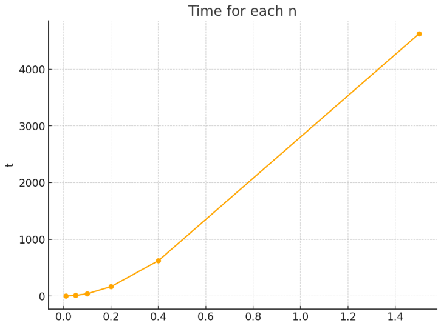

# Aplikace-SAT-solveru SET COVER PROBLEM

## Použité technologie
 Aplikace SAT solveru je naprogramována v jazyce Python s použitím SAT solveru Glucosce 4.2, kde jsou využity knihovny os, subprocess, itertools a argparse. Programu je určený pro operační systém Linux.

 ### Použité knihovny
 #### import os
 Pro nalezení glucose-syrup souboru.
 
 #### import subprocess
 Knihovna, která zprostředkuje spuštění SAT solveru v Pythonu.
 
 #### from itertools import combinations
 Pro vygenerování všech klauzulí, které řeší 1 část CNF formule. (Popis níže)
 
 #### import argparse
 Knihovna pro umožnění uživatelovi zadat vstupní parametry.
 
 ## Popis zadání
 Aplikace dostane množina U, která obsahuje čísla 1 až n a vstupní množinu S, která obsahuje číselné podmnožiny. Úkolem aplikace je najít podmnožiny z S, takové aby pokrily všechny prvky v množině U aneb každý číselný prvek v U
 je alespoň v jedné podmnožině z podmnožin splňující zadání. Podrobné zadání: https://en.wikipedia.org/wiki/Set_cover_problem

## Popis parametrů
python script přijímá pouze jeden argument z příkazové řádky, kterým je jméno souboru ve kterém jsou uložené příslušné parametry.

 ### Popis vstupních parametrů v souboru
 #### "n"
 číslo, které udává počet prvků v množině U, která obsahuje prvky 1 až n.
 
 "subsets"
 String reprezentující množinu obsahující číselné podmnožiny, kde prvky v podmnožině mohou obsahaovat pouze čísla, které musejí být oddělené čárkou (",") nebo pomlčkou ("-"), která určuje rozsah platných čísel v podmnožině. Jednotlivé podmnožiny musejí být ukončené středníkem (";"), tedy i poslední. Prázdná množina v našem případě je brána, jako chybný vstup, jelikož nemá žádný vliv na naší úlohu.
 
 #### "find_best"
 Uživatel si může zvolit zda chce najít nejlepší k nebo program spustit pro zadané k, pokud uživatel napíše "yes", pak aplikace hledá nejlepší k a nebere zřetel na zvolené k. Pokud uživatel nechce hledat nejlepší k, pak napište "no".

 #### "k"
 Maximální počet podmnožin, které splňují zadání. Program hledá splnitelné řešení pro k = 1,...k. Pokud uživatel nastaví find_best na "yes", pak tento parametr nemá význam v aplikaci.
  
 #### "header"
 Napsáním "yes" uživatel uvidí CNF formule, pokud napíše "no", pak se CNF formule nezobrazí na standartní výstup.

### Ukázkový vstup v souboru
50000 1,2-50;51-50000; no 2 no

### Ukázkové spuštení na příkazové řádce
py SAT_set_cover.py instance1.txt

## Instance
Jsou přiloženy instance v texttových souborech, kde instance1.txt až instance10.txt a wkipedie_instance.txt jsou splnitelné a instance unsatisfiable.txt je nesplnitelhá.

### Splnitelné instance
Jsou přiloženy instance 1 až 10 (instace1.txt až instace10.txt), které jsou splnitelné a také slouží k měření času naší aplikace. (viz experiment část). A také je přiložená splnitelná wikipedie_instance.txt z wikipedie zdroje napsaný
v popisu zadání.

### Nesplnitelná instance
Je přiložena jedna nesplnitelná instance unsatisfiable.txt.

### Inństance, který běží dée než 10 sekund
Příkladem je instance10.txt.

## Postup řešení
CNF formuli jsme vytvořili ze 2 částí.

### První část
Počet pokrívajících podmnožin může být maximálně k aneb počet pokrývajících podmnožin nesmí být k+1. Řešíme výrokem:

$$
\left( \bigwedge_{\substack{I \subseteq \{1, \dots, n\} \\ |I| = k+1}} \left( \bigvee_{i \in I} \neg S_i \right) \right)
$$

### Druhá část
Každý prvek z U musí náležet alespoň jedné podmnožině  z množiny řešící naší úlohu. Řešíme výrokem:

$$
\bigwedge_{u \in U} \left( \bigvee_{u \in S_i, S_i \subseteq S} S_i \right)
$$

### CNF formule
Konjunkcí našich výroků dostáváme finální výrok:

$$
\left( \bigwedge_{\substack{I \subseteq \{1, \dots, n\} \\ |I| = k+1}} \left( \bigvee_{i \in I} \neg S_i \right) \right) \wedge \left( \bigwedge_{u \in U} \left( \bigvee_{\substack{ \\ u \in S_i,S_i \subseteq S}} S_i \right) \right)
$$

## Výstup
Výstupem může být buď chybová hláška a nebo výsledek řešení naší úlohy. Nezávisle na případu  uživatel na výstup dostane čás běhu programu, kde celá výstupová zpráva je ohraničena pomlčkami.

### Chybný výstup
Pokud užívatel zadá chybný vstup, dostaneme chybovou hlášku na standartní vástup s textem WRONG INPUT.

WRONG INPUT

TIME IN SECONDS: 0.0

### Úspěšný výstup
Při úspšněm výstupu dostaneme seznam množin, které byly vybrány pro pokrytí množiny U s počtem vybraných podmnožin.

SELECTED SUBSETS: { S_1 S_4 }

COUNT OF SUBSETS 2

TIME IN SECONDS: 0.01

### Neúspěšný výstup
Pokud nelze najít řešení splňující zadání, uživatel dostane na výstup text NO SOLUTION FOR THIS TASK!!!

NO SOLUTION FOR THIS TASK!!!

TIME IN SECONDS: 0.01

## Experiment

Graf závislosti instance (která vždy obsahuje rovnoměrně rozdělené podmnožiny) na čase, kde si všiumněme zajímavého kolísání hodnot, kde naše funkce není pouze rostoucí s počtem zadaných podmnožin. Jednotlivé instance jsou v souborech
instance1.txt až instance10.txt.

                                          
